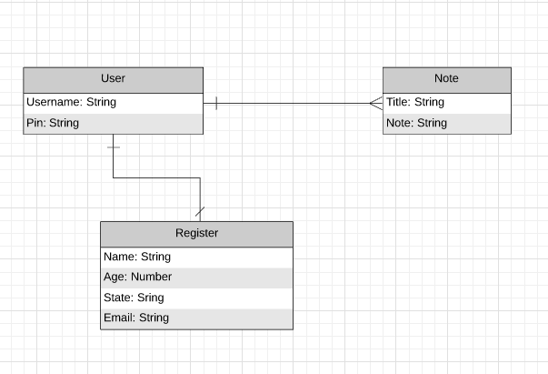

# Project 3: Online Journal

## Overview
The Online Journal is an online/mobile application that can be used by anyone from professionals to
a typical teenager. The idea of the Online Journal started as a thought of wondering if there were any online notepads or journals that require credentials to access. Due to it having authenications, no one else can access your information other than you, unless you provide your credentials to someone. In order to create this application, there was mostly `React` and `Mongoose` used in order to presist any data stored into your journal.

## Links
[Heroku](https://morning-falls-93398.herokuapp.com/ "Heroku")

[Project Board](https://github.com/justinparrish/project-three-journals/projects/1 "Project Board")

## Technologies Used

* Mongoose
* Expess
* React
* NodeJS
* Javascript
* Github Project Board
* Robo 3T
* Postman

## Wireframes

## Entity Relationship Diagram (ERD)
